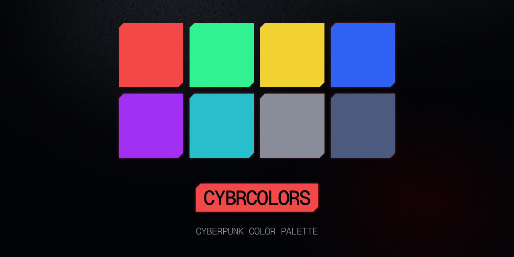
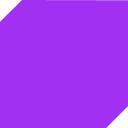
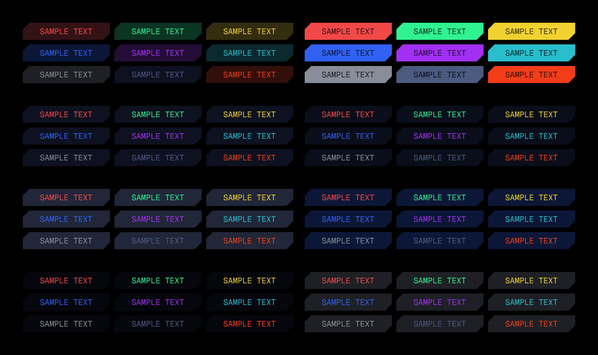

# Cybrcolors
Collection of hand-crafted wallpapers in a visual style inspired by the UI design language and color palette popularized by **Cyberpunk 2077**.  
Mimicking the way ambient light reflects on screen surfaces.

> [!WARNING]
> ### Check out my other project, [Cybrpapers](https://github.com/scherrer-txt/cybrpapers)!

## Color exports

<table>
<tr>
    <td>
        <a href="cybrcolors-gtk.css">
            
        </a>
    </td>
    <td>
        <a href="cybrcolors.scss">
            
        </a>
    </td>
    <td>
        <a href="cybrcolors.json">
            
        </a>
    </td>
    <td>
        <a href="ansi.md">
            
        </a>
    </td>
</tr>
</table>

## Color themes

<table>
<tr>
    <td>
        <a href="kitty.md">
            
        </a>
    </td>
    <td>
        <a href="micro.md">
            
        </a>
    </td>
    <td>
        
    </td>
</tr>
</table>

## In action
<table>
    <tr>
    <td></td>
    </tr>
    <tr>
    <td></td>
    </tr>
    <tr>
    <td></td>
    </tr>
</table>

> Backgrounds are made by me - check [Cybrpapers](https://github.com/scherrer-txt/cybrpapers)
> 
> Cyberpunk 2077 logos, visible in Kitty terminal, are made by [Valency](https://www.valencygraphics.com/cyberpunk-2077)


## Palette
<table>
	<tr>
		<th></th>
		<th>Labels</th>
		<th>Hex</th>
		<th>RGB</th>
		<th>HSL</th>
	</tr>
	<tr>
		<td></td>
		<td>Black (no0)</td>
		<td><code>#030408</code></td>
		<td><code>rgb(3, 4, 8)</code></td>
        <td><code>hsl(228, 63%, 3%)</code></td>
	</tr>
    <tr>
		<td></td>
		<td>Black mid (no1)</td>
		<td><code>#05070D</code></td>
		<td><code>rgb(5, 7, 13)</code></td>
        <td><code>hsl(225, 44%, 4%)</code></td>
	</tr>
    <tr>
		<td></td>
		<td>Black light (no2)</td>
		<td><code>#0A0E1A</code></td>
		<td><code>rgb(10, 14, 26)</code></td>
        <td><code>hsl(225, 44%, 7%)</code></td>
	</tr>
    <tr>
		<td></td>
		<td>Red base (re0)</td>
		<td><code>#F24848</code></td>
		<td><code>rgb(242, 72, 72)</code></td>
        <td><code>hsl(0, 87%, 62%)</code></td>
	</tr>
    <tr>
		<td></td>
		<td>Red mid (re1)</td>
		<td><code>#631F21</code></td>
		<td><code>rgb(99, 31, 33)</code></td>
        <td><code>hsl(358, 52%, 25%)</code></td>
	</tr>
    <tr>
		<td></td>
		<td>Red dark (re2)</td>
		<td><code>#331215</code></td>
		<td><code>rgb(51, 18, 21)</code></td>
        <td><code>hsl(355, 48%, 14%)</code></td>
	</tr>
    <tr>
		<td></td>
		<td>Green base (gr0)</td>
		<td><code>#30F291</code></td>
		<td><code>rgb(48, 242, 145)</code></td>
        <td><code>hsl(150, 88%, 57%)</code></td>
	</tr>
    <tr>
		<td></td>
		<td>Green mid (gr1)</td>
		<td><code>#15633F</code></td>
		<td><code>rgb(21, 99, 63)</code></td>
        <td><code>hsl(152, 65%, 24%)</code></td>
	</tr>
    <tr>
		<td></td>
		<td>Green dark (gr2)</td>
		<td><code>#0C3423</code></td>
		<td><code>rgb(12, 52, 35)</code></td>
        <td><code>hsl(155, 62%, 13%)</code></td>
	</tr>
    <tr>
		<td></td>
		<td>Yellow base (ye0)</td>
		<td><code>#F2D230</code></td>
		<td><code>rgb(242, 210, 48)</code></td>
        <td><code>hsl(50, 88%, 57%)</code></td>
	</tr>
    <tr>
		<td></td>
		<td>Yellow mid (ye1)</td>
		<td><code>#635618</code></td>
		<td><code>rgb(99, 86, 24)</code></td>
        <td><code>hsl(50, 61%, 24%)</code></td>
	</tr>
    <tr>
		<td></td>
		<td>Yellow dark (ye2)</td>
		<td><code>#332D10</code></td>
		<td><code>rgb(51, 45, 16)</code></td>
        <td><code>hsl(50, 52%, 13%)</code></td>
	</tr>
    <tr>
		<td></td>
		<td>Blue base (bl0)</td>
		<td><code>#3061F2</code></td>
		<td><code>rgb(48, 97, 242)</code></td>
        <td><code>hsl(225, 87%, 57%)</code></td>
	</tr>
    <tr>
		<td></td>
		<td>Blue mid (bl1)</td>
		<td><code>#152966</code></td>
		<td><code>rgb(21, 41, 102)</code></td>
        <td><code>hsl(225, 66%, 24%)</code></td>
	</tr>
    <tr>
		<td></td>
		<td>Blue dark (bl2)</td>
		<td><code>#0C1737</code></td>
		<td><code>rgb(12, 23, 55)</code></td>
        <td><code>hsl(225, 64%, 13%)</code></td>
	</tr>
    <tr>
		<td></td>
		<td>Purple base (pu0)</td>
		<td><code>#A130F2</code></td>
		<td><code>rgb(161, 48, 242)</code></td>
        <td><code>hsl(275, 88%, 57%)</code></td>
	</tr>
    <tr>
		<td></td>
		<td>Purple mid (pu1)</td>
		<td><code>#421666</code></td>
		<td><code>rgb(66, 22, 102)</code></td>
        <td><code>hsl(273, 65%, 24%)</code></td>
	</tr>
    <tr>
		<td></td>
		<td>Purple dark (pu2)</td>
		<td><code>#230D37</code></td>
		<td><code>rgb(35, 13, 55)</code></td>
        <td><code>hsl(271, 62%, 13%)</code></td>
	</tr>
    <tr>
		<td></td>
		<td>Cyan base (cy0)</td>
		<td><code>#29BECC</code></td>
		<td><code>rgb(41, 190, 204)</code></td>
        <td><code>hsl(185, 67%, 48%)</code></td>
	</tr>
    <tr>
		<td></td>
		<td>Cyan mid (cy1)</td>
		<td><code>#124E56</code></td>
		<td><code>rgb(18, 78, 86)</code></td>
        <td><code>hsl(187, 65%, 20%)</code></td>
	</tr>
    <tr>
		<td></td>
		<td>Cyan dark (cy2)</td>
		<td><code>#0B292F</code></td>
		<td><code>rgb(11, 41, 47)</code></td>
        <td><code>hsl(190, 62%, 11%)</code></td>
	</tr>
    <tr>
		<td></td>
		<td>White base (wh0)</td>
		<td><code>#898D99</code></td>
		<td><code>rgb(137, 141, 153)</code></td>
        <td><code>hsl(225, 7%, 57%)</code></td>
	</tr>
    <tr>
		<td></td>
		<td>White mid (wh1)</td>
		<td><code>#393B42</code></td>
		<td><code>rgb(57, 59, 66)</code></td>
        <td><code>hsl(227, 7%, 24%)</code></td>
	</tr>
    <tr>
		<td></td>
		<td>White dark (wh2)</td>
		<td><code>#1E2025</code></td>
		<td><code>rgb(30, 32, 37)</code></td>
        <td><code>hsl(223, 10%, 13%)</code></td>
	</tr>
    <tr>
		<td></td>
		<td>Metal grey base (me0)</td>
		<td><code>#4D5A80</code></td>
		<td><code>rgb(77, 90, 128)</code></td>
        <td><code>hsl(225, 25%, 40%)</code></td>
	</tr>
    <tr>
		<td></td>
		<td>Metal grey mid (me1)</td>
		<td><code>#212638</code></td>
		<td><code>rgb(33, 38, 56)</code></td>
        <td><code>hsl(227, 26%, 17%)</code></td>
	</tr>
    <tr>
		<td></td>
		<td>Metal grey dark (me2)</td>
		<td><code>#0D1120</code></td>
		<td><code>rgb(13, 17, 32)</code></td>
        <td><code>hsl(227, 42%, 9%)</code></td>
	</tr>
    <tr>
		<td></td>
		<td>Orange base (or0)</td>
		<td><code>#F23D18</code></td>
		<td><code>rgb(242, 61, 24)</code></td>
        <td><code>hsl(10, 89%, 52%)</code></td>
	</tr>
    <tr>
		<td></td>
		<td>Orange mid (or1)</td>
		<td><code>#631B0E</code></td>
		<td><code>rgb(99, 27, 14)</code></td>
        <td><code>hsl(9, 75%, 22%)</code></td>
	</tr>
    <tr>
		<td></td>
		<td>Orange dark (or2)</td>
		<td><code>#330F0B</code></td>
		<td><code>rgb(51, 15, 11)</code></td>
        <td><code>hsl(6, 65%, 12%)</code></td>
	</tr>

</table>

---

## Usage
```code
Recommended usage of colors:

    no0            background
    re0            main text, outlines
    gr0            success state
    ye0            warning
    bl0            ---
    cy0            ---
    wh0            small text
    or0            ---

    no1 & no2      hover, states, depth
    re1 & re2      hover, states, depth
    gr1 & gr2      hover, states, depth
    ye1 & ye2      hover, states, depth
    bl1 & bl2      hover, states, depth
    pu1 & pu2      hover, states, depth
    cy1 & cy2      hover, states, depth
    wh1 & wh2      hover, states, depth
    me1 & me2      hover, states, depth
    or1 & or2      hover, states, depth
```
Recommended combinations:

</td>

## Process
### Starting values
```code
I used hsl color space (hue, saturation, lightness) to define starting values,
which are below, to then generate the palette. Final exported colors differ
after contrast adjustments and black-overlay blending (more on that below).

Starting values:
    Main:
        red         hsl(0, 80%, 95%)
        green       hsl(150, 80%, 95%)
        yellow      hsl(50, 80%, 95%)
        blue        hsl(225, 80%, 95%)
        purple      hsl(275, 80%, 95%)
        cyan        hsl(185, 80%, 80%)
        orange      hsl(10, 80%, 95%)
    UI:
        black       hsl(225, 60%, 3%)
        white       hsl(225, 10%, 60%)
        grey        hsl(225, 40%, 50%)

Main colors are hsl(x, 80%, 95%), where x is the hue.

    Except for cyan, which has lightness 80 to
    accommodate for the fact that cyan is a very bright color.
```
### Naming convention
```code
Naming convention is optimized for simplicity and for auto-complete use.
The goal was for each color to have a different first letter.

    Color names:
        red         re
        green       gr
        yellow      ye
        blue        bl
        purple      pu
        cyan        cy
        orange      or
        black       no       as in: no-signal
        grey        me       as in: metal
```
### Contrast ratio
```code
Main goal was to hit at least AA score in contrast ratio on black:

    re0 on no0      (AA)
    gr0 on no0      (AAA)
    ye0 on no0      (AAA)
    bl0 on no0      (AA Large)
    pu0 on no0      (AA Large)
    cy0 on no0      (AAA)
    wh0 on no0      (AA)
    me0 on no0      (AA Large)
    or0 on no0      (AA)
```
### Generating shades
```code
Darker shades (xy1 and xy2) are created by mixing each base color (xy0) with
the black base (no0). This guarantees consistent darkening across the palette
and avoids potential issues with semi-transparent rgba overlays.
    
    Opacity settings:
        xy1         40%
        xy2         20%

    Example:
        re1         = mix(re0, no0, 40%)

Resulting colors are then used to define the final hexadecimal and HSL values.
```
### Result
```code
After mixing base color with black base, these are the resulting colors:
    
    Black:
        no0         hsl(228, 63%, 3%)
        no1         hsl(225, 44%, 4%)
        no2         hsl(225, 44%, 7%)
    Red:
        re0         hsl(0, 87%, 62%)
        re1         hsl(358, 52%, 25%)
        re2         hsl(355, 48%, 14%)
    Green:
        gr0         hsl(150, 88%, 57%)
        gr1         hsl(152, 65%, 24%)
        gr2         hsl(155, 62%, 13%)
    Yellow:
        ye0         hsl(50, 88%, 57%)
        ye1         hsl(50, 61%, 24%)
        ye2         hsl(50, 52%, 13%)
    Blue:
        bl0         hsl(225, 87%, 57%)
        bl1         hsl(225, 66%, 24%)
        bl2         hsl(225, 64%, 13%)
    Purple:
        pu0         hsl(275, 88%, 57%)
        pu1         hsl(273, 65%, 24%)
        pu2         hsl(271, 62%, 13%)
    Cyan:
        cy0         hsl(185, 67%, 48%)
        cy1         hsl(187, 65%, 20%)
        cy2         hsl(190, 62%, 11%)
    White:
        wh0         hsl(225, 7%, 57%)
        wh1         hsl(227, 7%, 24%)
        wh2         hsl(223, 10%, 13%)
    Grey:
        me0         hsl(225, 25%, 40%)
        me1         hsl(227, 26%, 17%)
        me2         hsl(227, 42%, 9%)
    Orange:
        or0         hsl(10, 89%, 52%)
        or1         hsl(9, 75%, 22%)
        or2         hsl(6, 65%, 12%)
```

---

## To-do
- [ ] Adjust or0 to be more recognizable next to re0
- [ ] Validate contrast and distinguishability under simulated color vision deficiency (CVD) conditions.

---

## Disclaimer

This project is an independent, fan-inspired art collection.  
It is **not affiliated with, endorsed by, or sponsored by CD PROJEKT RED** or *Cyberpunk 2077*.

All images in this repository are original works created by **Kevin Scherrer**, released under the  
**[CC0 1.0 Universal (Public Domain)](https://creativecommons.org/publicdomain/zero/1.0/)** license.

Use, remix, and share freely. Attribution is appreciated but not required.